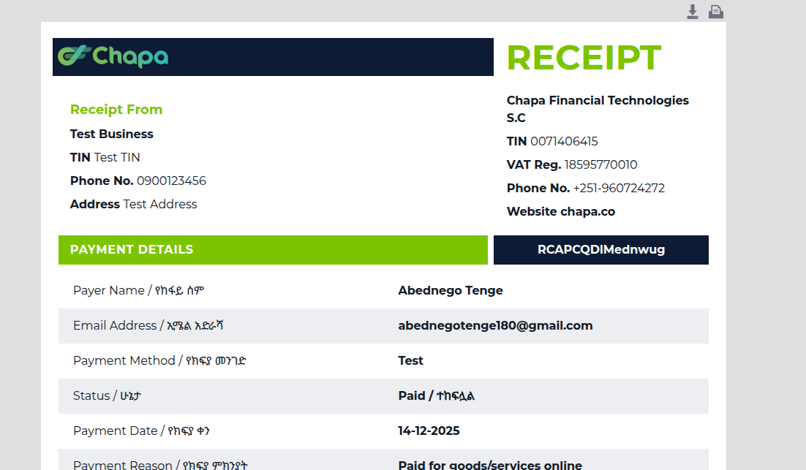

# Django REST API --- Listings & Bookings

A fully functional backend API built using **Django** and **Django REST
Framework (DRF)**.\
This project demonstrates clean API design using **ModelViewSets**,
**serializers**, and **DRF routers** for automatic CRUD endpoint
generation.

## Features

-   Django REST Framework powered API\
-   `ModelViewSet` for clean CRUD logic\
-   Automatic URL generation using `DefaultRouter`\
-   API for managing **Listings**\
-   API for managing **Bookings**\
-   DRF Serializers for validation\
-   Authentication using Django/DRF auth\
-   Follows REST API best practices

## Tech Stack

  Layer               Technology
  ------------------- ------------------------
  Backend Framework   Django
  API Toolkit         Django REST Framework
  Database            SQLite / PostgreSQL
  Authentication      DRF Auth / Django Auth
  Serialization       DRF Serializers

## Project Structure

project_root/ 
│ 
├── app/ 
│ ├── models.py 
│ ├── serializers.py 
│ ├──views.py 
│ ├── urls.py 
│ 
├── project/ 
│ ├── settings.py 
│ ├── urls.py 
│
└── README.md

## Installation & Setup

### 1. Clone the repository

git clone https://github.com/yourusername/yourproject.git cd yourproject

### 2. Create a virtual environment
python -m venv venv
source venv/bin/activate       # macOS/Linux
venv\\Scripts\\activate        # Windows

### 3. Install dependencies

pip install -r requirements.txt

### 4. Run migrations

python manage.py migrate

### 5. Start the server

python manage.py runserver

## API Routing (Using DefaultRouter)

from rest_framework.routers import DefaultRouter from .views import
ListingViewSet, BookingViewSet

router = DefaultRouter() router.register(r'listings', ListingViewSet,
basename='listing') router.register(r'bookings', BookingViewSet,
basename='booking')

urlpatterns = router.urls

## Endpoints Overview

### Listings (/listings/)

GET /listings/\
POST /listings/\
GET /listings/{id}/\
PUT /listings/{id}/\
DELETE /listings/{id}/

### Bookings (/bookings/)

GET /bookings/\
POST /bookings/\
GET /bookings/{id}/\
PUT /bookings/{id}/\
DELETE /bookings/{id}/

testing for payment

## License

MIT License
